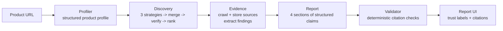

# AI Competitive Intelligence Platform

Enter a software product's URL. Get an evidence-backed competitive report —
competitor discovery, feature comparison, and pricing analysis across up to
five verified competitors, where **every factual claim links to a retrievable
public source with its retrieval date**.

> **Live demo: [ai-competitive-intelligence-eight.vercel.app](https://ai-competitive-intelligence-eight.vercel.app)** · Demo video: _pending final UI_

Built as a portfolio project for APM/PM applications, around one principle:
an AI-generated competitive report is only useful if a PM can quickly verify
it. V1 optimizes for evidence quality, source traceability, and **measured**
accuracy — not report length or technical flash.

## Measured results (10-product benchmark)

| Metric | Target (design doc) | Baseline | After iteration |
|---|---|---|---|
| Competitor precision | ≥70% | 84% strict / 100% lenient | 84% / 100% |
| Citation coverage (automated) | ≥90% | 100% | 100% |
| Citation validity (human-reviewed, n=30) | — | 86.7% | re-review in progress |
| Hallucination rate (human-reviewed) | ≤5% | **0%** | re-review in progress |
| Pricing accuracy (labeled tiers) | ≥80% | 100% | 100% |
| **Pricing availability** (companies with extracted pricing) | — | 70% | **85%** |
| Category accuracy | — | 100% | 100% |
| Mean latency | <10 min | 142s | 154s |
| Mean cost / report | ≤$1.20 | $0.34 | $0.36 |

The improvement row is the project's core loop working: the benchmark + a
human citation review identified pricing-page retrieval as the highest-impact
failure mode; a targeted fix (headless-browser rendering + pricing-URL
discovery) lifted pricing availability **70% → 85%** at a measured cost of
+12s and +2.2¢ per report. Full tables: [`eval/results/`](eval/results/)
(`baseline.md`, `post-fix.md`, `comparison.md`). Three documented failures and
the product changes they drove: [failure gallery](docs/failure-gallery.md).

## How it works



1. **Profiler** — crawls the product's site and extracts a structured profile
   (category, audience, features, pricing) via Claude structured outputs.
   Grounding rule: page text only, `null` over guessing.
2. **Competitor discovery** — three independent strategies (model-generated
   leads, "alternatives to X" search extraction, the company's own comparison
   pages), merged and deduped. **Model output is treated as leads, not
   evidence**: every candidate's live website is crawled and independently
   verified against the product profile before selection. Ranked by
   verification confidence + cross-strategy frequency; capped at 5.
3. **Evidence collection** — homepage/features/pricing pages stored as source
   records (URL, retrieval time, HTTP status, content hash — failures too).
   Findings (positioning, features, pricing tiers) each carry the
   `source_ids` they were extracted from. Pricing comes only from pricing
   pages, with a headless-Chromium fallback for JS-rendered pages, or is
   reported unavailable — never estimated.
4. **Report generation** — four sections generated from stored findings only.
   The model returns **structured claims** (text, claim type, source_ids,
   confidence) stored in their own table, so citation coverage is computed,
   not estimated. Trust model: `Verified` (company's own site) / `Reported`
   (secondary source) / `Interpretation` (labeled AI analysis).
5. **Ask the analyst** (post-V1 extension) — a bounded agent loop on every
   report page: the model autonomously selects tools (claims, findings,
   stored sources, fresh search, crawling) to answer follow-up questions,
   capped at six turns, answers cited, tool trace visible in the UI.
6. **Validation** — a deterministic pre-display pass flags unsourced factual
   claims, dangling citations, pricing claims without a primary pricing
   source, and judgment language in factual claims.
7. **Evaluation** — a core feature, not an afterthought: a 10-product labeled
   benchmark, automated metrics, and a human review protocol for citation
   validity and hallucination rate.

## Stack

| Layer | Choice | Why |
|---|---|---|
| Backend | Python, FastAPI, SQLite (WAL) | Explicit bounded pipeline; no agent loops, no job queue, no vector DB — smallest thing that works |
| AI | Claude Opus 4.8 (profiling/synthesis) + Claude Haiku 4.5 (extraction/verification) | Quality where it matters, cost control where it's called 20× per run |
| Retrieval | Tavily search + httpx/trafilatura crawler + Playwright rendered fallback | Current public evidence; JS pages readable |
| Frontend | Next.js, React, TypeScript, Tailwind | Report UI with trust labels and claim-level citations |
| Tool interface | The four research tools, also exposed via [MCP](docs/mcp.md) | Portable: any MCP client can drive the toolchain |
| Eval | Labeled benchmark + deterministic metrics + human review worksheet | Published results incl. regressions |

## Run it locally

```bash
# backend (Python 3.12, uv)
cd backend
cp ../.env.example .env       # add ANTHROPIC_API_KEY + SEARCH_API_KEY (Tavily)
uv sync && uv run playwright install chromium
uv run uvicorn app.main:app --port 8000

# frontend
cd frontend
npm install && npm run dev    # http://localhost:3000

# tests (71) and benchmark
cd backend && uv run pytest
uv run python ../eval/run_eval.py --version my-run
```

## Repo map

- `backend/app/` — pipeline modules: `profiler` → `discovery` → `evidence` →
  `report` → `pipeline`, plus `evaluation` (metrics) and `tools/` (search,
  crawler, rendered crawler)
- `backend/mcp_server.py` — the research tools exposed as an
  [MCP server](docs/mcp.md) usable from Claude Desktop / Claude Code
- `eval/` — benchmark labels, runner, published results
- `docs/` — [failure gallery](docs/failure-gallery.md) ·
  [design decisions & deviations](docs/design-decisions.md) ·
  [deployment guide](docs/deployment.md) · original design doc (PDF)
- `journal.md` / `status.md` — the project's build log and living status
