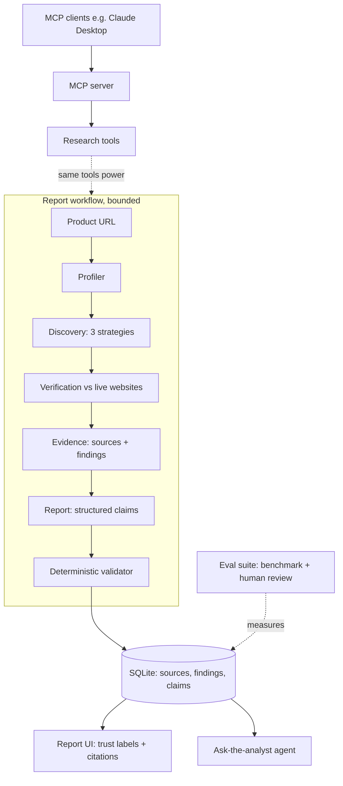

# AI architecture

One page on every AI component in this platform, how they fit together, and
what was deliberately left out. Written for readers who want to know whether
the AI here is engineered or sprinkled.

## The mental model

A **bounded AI workflow** produces the report: fixed, code-orchestrated
stages where models do the reading, judging, and writing, and plain code does
the orchestration, storage, and verification. Two layers sit on top: an
**agent** for follow-up questions and an **MCP server** that exposes the
toolchain to external AI clients.

## Components

### LLMs, tiered by economics
Claude Opus 4.8 handles the synthesis-heavy steps (product profiling, report
sections, the analyst agent). Claude Haiku 4.5 handles extraction and
classification, which run ~20x per report (search-result parsing, per-candidate
website verification, pricing extraction). Capability follows task difficulty;
cost follows call frequency. Result: ~$0.36 per full report.
`app/config.py`, `app/llm.py`.

### Structured outputs everywhere
Every model call uses schema-validated structured outputs (Pydantic models via
`messages.parse()`), so profiles, verdicts, pricing tiers, and claims arrive
as typed objects, never parsed prose. This is what makes claims database rows,
and therefore what makes citation coverage a computed number.

### RAG, the structured kind
Classic retrieval-augmented generation, minus the vector database: Tavily
search plus a crawler (trafilatura for static pages, headless Chromium for
JS-rendered ones) retrieves a bounded set of pages per run; Haiku converts
them into normalized findings rows carrying `source_ids`; Opus generates the
report **only from those findings**. Provenance is a database join, not a
similarity score. `app/evidence.py`, `app/tools/`.

### Tool use
The research capability is factored into independently tested tools:
`search_web`, `crawl_page` / `crawl_page_rendered`, `extract_pricing`, plus
the profiler and discovery built on them. Soft-failure contract throughout:
a dead site produces a recorded failure, never a crashed run.

### The agent: Ask the analyst
Every report page has a follow-up question box backed by a real agent loop
(`app/analyst.py`): the model autonomously chooses among five tools — the
report's claims, structured findings, stored source text, fresh web search,
live page crawling — and iterates until it can answer. Bounded on purpose:
maximum six turns (the last one runs tool-less to force an answer),
per-question cost tracking, citations validated against the run's real
sources, and the tool trace rendered in the UI so the agency is visible.
Typical question: 2 turns, ~4 cents.

### The MCP server
`backend/mcp_server.py` exposes the toolchain over the Model Context Protocol
(official SDK): `search_web`, `crawl_page_text`, `extract_pricing`,
`profile_product`, `discover_competitors`. Any MCP client (Claude Desktop,
Claude Code) can drive the same verified tools the pipeline uses; the repo's
`.mcp.json` registers it automatically in Claude Code. See `docs/mcp.md`.

### Grounding and anti-hallucination, in layers
1. **Prompt-level**: extraction and generation prompts forbid outside
   knowledge; missing information becomes null, never a guess.
2. **Architectural**: the report generator only ever sees stored findings;
   model-suggested competitors are leads that must survive live-website
   verification before selection (this caught an acquired company that model
   memory still listed as independent).
3. **Deterministic**: a plain-code validator flags unsourced factual claims,
   dangling citations, and pricing claims without a primary pricing source
   before anything is displayed. Generation is probabilistic; verification
   is not.
4. **Visible**: Verified / Reported / Analysis trust labels and per-claim
   citations with retrieval dates put the evidence boundary in the UI.

Human-reviewed result on the benchmark: **0% hallucination rate**.

### Evaluation as a product feature
A 10-product labeled benchmark (`eval/`), automated metrics (competitor
precision, pricing accuracy, citation coverage, latency, cost), a human
review protocol for citation validity and hallucination rate, and one closed
improvement loop: the eval identified pricing-page retrieval as the worst
failure mode, a targeted fix shipped (rendered fallback + pricing-URL
discovery), and re-measurement showed pricing availability rising 70% → 85%.
Results, including failures: `eval/results/`.

## Deliberately absent

- **Vector database / embeddings** — at ~18 pages per run, everything fits
  in context, and structured findings give exact provenance where similarity
  search gives approximations. The written rationale (and the conditions
  under which vectors *would* be added) is in `docs/design-decisions.md`.
- **Autonomous pipeline agents** — the report workflow is fixed code, not a
  model choosing steps: predictable cost, attributable failures. Agency is
  reserved for the one place it earns its keep (follow-up Q&A), and bounded
  there.
- **Fine-tuning** — prompting, structured outputs, and an eval loop reached
  the quality bar without custom training.

The through-line: everything the AI produces here is **grounded, bounded, or
measured** — usually all three.
